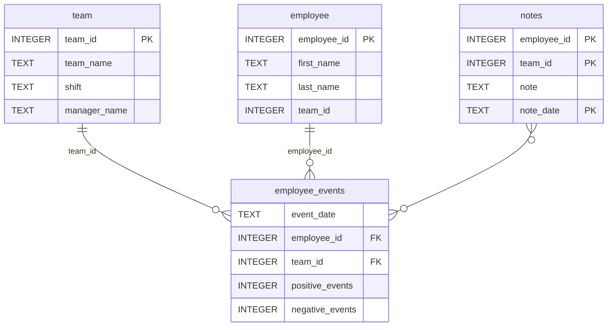

python package for reading a sample `employee_events.db`, as part of udacity's data scientist course

### employee_events.db

```mermaid
erDiagram

  employee {
    INTEGER employee_id PK
    TEXT first_name
    TEXT last_name
    INTEGER team_id
    
  }

  employee_events {
    TEXT event_date
    INTEGER employee_id FK
    INTEGER team_id FK
    INTEGER positive_events
    INTEGER negative_events
  }

  notes {
    INTEGER employee_id PK
    INTEGER team_id PK
    TEXT note
    TEXT note_date PK
  }

  team {
    INTEGER team_id PK
    TEXT team_name
    TEXT shift
    TEXT manager_name
  }

  team ||--o{ employee_events : "team_id"
  employee ||--o{ employee_events : "employee_id"
  notes }o--o{ employee_events : ""
```